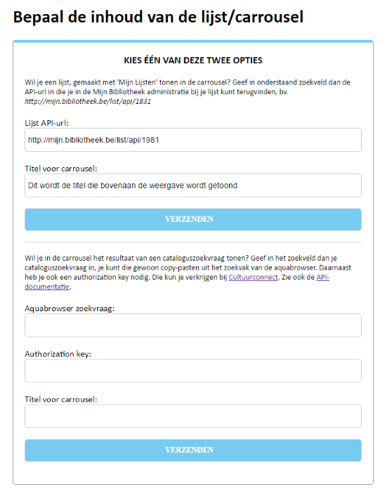

# b.a.d.  

Dit project (b.a.d., kort voor bib API ding, ja ik hou van flauwe woordspelingen) is een voorbeeldimplementatie van hoe de [bibportalen API](http://www.cultuurconnect.be/diensten/bibliotheekportalen/open-data) gebruikt kan worden voor het tonen van bibcatalogusdata op een website.

In de projectbestanden is veel commentaar opgenomen om het makkelijker te maken om dit project te gaan hergebruiken voor je eigen toepassingen. Een beetje basiskennis van html/css/jquery is wel aan te raden.

Hieronder zie je enkele demo-weergaves, [of klik door voor een live-demo](http://geaplamp2.cipal.be/bibapiding/result_sprinters.html)

## HOE GEBRUIKEN

##### A Standalone
Het idee is dat je één van de voorbeeldweergaves uit het project op een scherm kunt tonen. De full-hd versie van de carrousel is hiervoor de meest voor de hand liggende keuze. Deze kan bv. op een display in de bib gebruikt worden om aanwinsten, themaselecties, enz. te adverteren. Als het scherm touchbediening ondersteunt, dan kan met een druk op een cover het detailscherm van dat item opgeroepen worden.

###### Configuratie voor eerste gebruik
- Kopieer de projectbestanden naar je webserver. Die moet php ondersteunen voor het configuratiescherm. 
- In *login.php* is de mogelijkheid voorzien om een paswoord in te stellen, als je deze bestanden op een server zet die via het internet toegankelijk is dan kun je dat best doen. Speur naar deze regel in het bestand:
 
> ` if ($login == "") // vul tussen de aanhalingstekens een wachtwoord naar keuze in `

- Ook in *config.php* moet je nog een regeltje aanpassen. Op regel 184 moet je de juiste url van jouw catalogus invullen door 'gemeente' te wijzigen in jouw bib/gemeentenaam:

> ` $ablsearch = "http://zoeken.gemeente.bibliotheek.be/api/v0/search/?q=" . $zoekstring . "&authorization=" . $ablauthkey;   `

- In de veronderstelling dat je enkel de full-hd carrousel wilt weerhouden: pas *result.html* aan om enkel die weergave over te houden. Ik heb hiervoor gedetailleerde instructies geplaatst in het bestand [stylingStandaloneFullHD.css](https://github.com/kdw2060/b.a.d./edit/master/stylingStandaloneFullHD.css).

###### Gebruik
- Surf op je webserver naar login.php en geef je wachtwoord in. Je krijgt dan toegang tot het eigenlijke configuratiescherm.

- Om in te stellen welke items in de carrousel of lijst moeten weergegeven worden. Je kunt kiezen uit een 'Mijn Lijsten' lijst of een een Aquabrowser zoekopdracht. Je kunt meteen ook een titel meegeven die bovenaan de carrousel getoond zal worden.

- Als je geen foutmelding ziet na het klikken op 'verzenden' dan is het verwerken van de xml met de resultaten normaalgezien geslaagd.
- Je wordt automatisch doorgestuurd naar de resultatenpagina. / Stel de url van deze pagina in op het systeem dat je gebruikt om bv. een display aan te sturen.

*Wat als je webserver geen php ondersteunt?* --> het is ook mogelijk om result.html zonder het configuratiescherm te gebruiken. Dit is wel iets omslachtiger. Je moet dan in je browser manueel naar de api-url's surfen en 'opslaan als' kiezen wanneer de xml-resultaten in de browser getoond worden. Sla het bestand op met exact dezelfde bestandsnaam als in mijn voorbeeldcode (`local_copy_of_feed.xml`) en bewaar dit in dezelfde map als *result.html*. Als je vervolgens *result.html* opent zal je opgeslagen xml bestand weergegeven worden. Voor het opslaan van meerdere xml-pagina's: zie in de code wat je achter de api-url moet typen om de 2de, 3de enz. pagina op te roepen en volg ook daarbij de bestandsnaming die je in de code ziet staan.

##### B Integreren in je eigen website
De drie overige voorbeeldweergaves (small en medium carrousel en de lijstweergave) zijn eerder bedoeld om te integreren in een bestaande website. Ik ga er van uit dat je weet hoe je daarop zelf de aanwezige html-files of template-files kunt aanpassen.

- Volg de eerste 3 stappen van 'Configuratie voor eerste gebruik' uit sectie A hierboven. 
- De laatste stap sla je over, in de plaats daarvan neem je de links naar de scripts en stylesheets uit de head sectie van *result.html* op in de head sectie van je eigen webpagina. Pas waar nodig de verwijzingen aan aan de mappenstructuur die je gebruikt.
- Voorzie zelf een lege div in je bestaande webpagina, daar waar je de carrousel of lijst wil gaan laten verschijnen en geef die een id of klassenaam naar keuze of gebruik voor het gemak de benamingen uit mijn demopagina.
- Kopieer het deel tussen de script-tags op het einde van result.html naar je eigen webpagina, plaats dit daar ook op het einde voor de afsluitende body-tag.
- Verwijder de code-stukjes van de voorbeeldweergaves die je niet wenst te gebruiken (zie stap 3 comment in result.html)
- Indien jouw div een zelfgekozen id- of klassenaam gebruikt, pas dan in het codestuk dat je overhoudt de jquery-selector aan en verwijs naar de lege div die je eerder creëerde. Pas in dat geval ook in *scripts.js* de jquery-selector aan.
- Run *config.php* (moet in dezelfde map staan als de webpagina waarop je de carrousel of lijst hebt geïntegreerd, zoniet moet je na het uitvoeren van *config.php* de gegenereerde xml bestanden manueel kopiëren naar de map van de webpagina).
- Open je webpagina, de carrousel of lijst zou daar nu in moeten verschijnen.
- Speel met *styling.css* voor een weergave die mooi aansluit bij je eigen website.

*Wat als je webserver geen php ondersteunt?* --> zie de werkwijze beschreven bij sectie A hierboven

## RELEASES
v1: 28-6-2016

v2: 7-7-2016 Bevat volgende verbeteringen
* een gebruiksvriendelijker en beter gelay-out configuratiescherm
* foutdetectie in de scripts (voor het geval een foute url wordt ingegeven of deze geen resultaten geeft)
* aanpassing script naar standaard xml-feed instelling van 20 zoekresultaten / pagina

Gepland in volgende releases:
* placeholders voor wanneer een catalogusrecord geen cover of korte inhoud heeft

## THANKS TO
Dit project maakt gebruik van:
* [jquery](https://jquery.com/)
* [slick](http://kenwheeler.github.io/slick/)
* [colorbox](http://www.jacklmoore.com/colorbox/)

En ook bedankt aan Jeroen Cortvriendt voor de voorbeeldcode die hij mij eerder bezorgde.

## ONDERSTEUNING
Ik bied gratis ondersteuning aan openbare bibliotheken uit Vlaanderen en Brussel die van dit project gebruik wensen te maken, maar ergens vastlopen. [Contacteer me](http://www.provincieantwerpen.be/content/modules/nl/contactpersonen/provinciaal/dcul/provinciaal-bibliotheekcentrum-vrieselhof/kris-de-winter.html) via e-mail vanaf een bibliotheek e-mailadres.

Voor de rest mag iedereen die dat wil de code gebruiken, hergebruiken enz. Een kleine bronvermelding wordt geapprecieerd.
